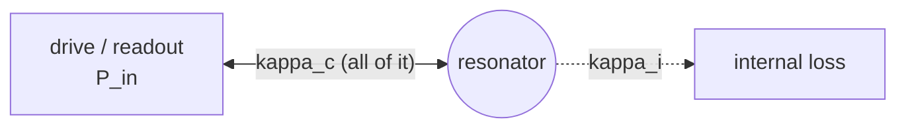
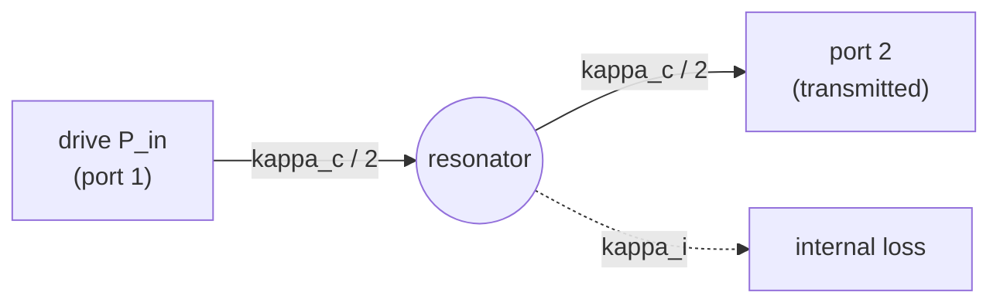

# Photon-number conversion in `resonator_tools`: derivation and literature cross-check

**Scope.** This note derives the relationship between calibrated incident microwave power and the mean
intracavity photon number $\bar n$ for the two resonator geometries handled by `resonator_tools`
(`reflection_port`, `notch_port`), cross-checks the result against an independent circuit calculation, and
reconciles it with the papers referenced in [PR #21](https://github.com/sebastianprobst/resonator_tools/pull/21).
It is restricted to steady, resonant ($\Delta=0$), coherent drive of a linear, single mode; thermal
occupation and detuned/nonlinear response are outside its scope (see [§7](#7-assumptions-and-limits)).

## 1. Result

$$
\bar n_{\rm reflection}=\frac{4\,\kappa_c\,P_{\rm in}}{\hbar\omega_r(\kappa_i+\kappa_c)^2},
\qquad
\bar n_{\rm notch}=\frac{2\,\kappa_c\,P_{\rm in}}{\hbar\omega_r(\kappa_i+\kappa_c)^2}.
$$

Here $\kappa_c=\omega_r/Q_c$ is the **total** external energy-decay rate (as extracted from the fitted
circle diameter — see [§2](#2-resonator-geometries)), $\kappa_i=\omega_r/Q_i$ the internal decay rate, and
$P_{\rm in}$ the incident traveling-wave power at the device reference plane. The factor is **4** for a
genuine one-port (reflection) resonator and **2** for a symmetric notch/hanger resonator driven from one
feedline end. This matches the current `resonator_tools` implementation:

| Class | Method | Coefficient |
|---|---|---|
| `reflection_port` | `get_photons_in_resonator`, `get_single_photon_limit` | `4.0` (unchanged) |
| `notch_port` | `get_photons_in_resonator`, `get_single_photon_limit` | `2.0` (corrected from `4.0`) |

[PR #21](https://github.com/sebastianprobst/resonator_tools/pull/21) changes the coefficient in
`reflection_port.get_photons_in_resonator` from `4.0` to `2.0`. That is physically incorrect: it breaks the
(previously correct) reflection formula and does not touch the `notch_port` methods, where the error
actually existed.

## 2. Resonator geometries

Three measurement geometries are commonly used (see McRae et al. 2020, Fig. 1, and Probst et al. 2015, Fig. 1);
`resonator_tools` implements the first two:

**Reflection — one port, single feedline.** The device is probed and read out through the *same* physical
port; there is only one external decay channel.

```
            ┌────────────────────┐
   P_in  ──►│                    │
            │   Z0 feedline      │  κc  (the only external channel)
   P_out ◄──│                    ├───────────►  ┌───────────┐
            └────────────────────┘               │ resonator │
                                                   └─────┬─────┘
                                                          │ κi (internal loss)
```



**Notch / hanger — two-port, side-coupled to a through feedline.** The resonator hangs off a single point
of a feedline that extends in *both* directions; the drive enters one end (port 1) and the transmitted
signal is read out at the other end (port 2). The resonator radiates symmetrically into both directions, so
the *total* external rate $\kappa_c$ (the one obtained from the circle-fit diameter) is shared equally:
$\kappa_{c,1}=\kappa_{c,2}=\kappa_c/2$.

```
  P_in ───────●───────────────────────► P_transmitted (port 2)
  (port 1)    │
              │   κc total, split κc/2 to the left and κc/2 to the right
        ┌─────┴─────┐
        │ resonator  │── κi (internal loss)
        └────────────┘
```



**Inline transmission — two-port, resonator in series in the line.** Mentioned for completeness (McRae et
al. Eq. 15); `resonator_tools` does not implement a photon-number conversion for it (`transmission_port`
leaves both methods unimplemented).

The distinguishing physical fact is **how much of the total external decay rate $\kappa_c$ is actually
driven**: all of it for reflection, half of it for a symmetric, single-sided-driven notch.

## 3. Definitions

$$
\omega_r=2\pi f_r,\qquad
\kappa_i=\frac{\omega_r}{Q_i},\qquad
\kappa_c=\frac{\omega_r}{Q_c},\qquad
\kappa=\kappa_i+\kappa_c=\frac{\omega_r}{Q_l}.
$$

$\kappa$ is the mode's **energy** decay rate ($U(t)\propto e^{-\kappa t}$ in free decay); the field amplitude
decays at half that rate, $a(t)\propto e^{-\kappa t/2}$. Conflating the two is the classic source of
factor-of-2 errors, and is explicitly flagged in Clerk et al. (2010), Eq. (474): *"Note the important factor
of 2. The amplitude decays at half the rate of the intensity."*

## 4. General input-output result

Clerk, Devoret, Girvin, Marquardt & Schoelkopf (2010), Appendix E.2, derive the driven-cavity master equation
for a single mode coupled to an external channel,

$$
\dot{\hat a}=\frac{i}{\hbar}[\hat H_{\rm sys},\hat a]-\frac{\kappa}{2}\hat a-\sqrt\kappa\,\hat b_{\rm in}(t)
\qquad\text{[Eq. (478)]},
\qquad
\hat b_{\rm out}=\hat b_{\rm in}+\sqrt\kappa\,\hat a
\qquad\text{[Eq. (483)]},
$$

and, for a **two-sided** cavity with channel rates $\kappa_L,\kappa_R$ ($\kappa=\kappa_L+\kappa_R$), give the
incident power driven into the left port in terms of the steady-state occupation directly:

$$
P=\hbar\omega\,\frac{\kappa^2}{4\kappa_L}\left\langle \hat a^\dagger\hat a\right\rangle
\qquad\text{[Eq. (492)]}.
$$

This is exactly the general relation needed here, with $\kappa_L$ relabelled as the **driven** channel's
rate $\kappa_d$ and $\kappa$ as the *total* decay (their derivation of $\kappa$, Eq. (470)/(476), sums the
Golden-Rule rate over *all* bath channels — it does not matter whether an unmonitored channel is another
port or true dissipation, since only a channel that carries a coherent classical drive amplitude contributes
a driving term; an internal-loss channel $\kappa_i$ enters the algebra identically to an undriven port).
Inverting for the mean photon number:

$$
\bar n=\frac{4\kappa_d}{\kappa^2}\frac{P_{\rm in}}{\hbar\omega_r},
\qquad \kappa=\kappa_i+\sum_j\kappa_j .
\tag{$\star$}
$$

Clerk et al. immediately give the two limits that settle this question directly:

* **Single-sided (reflection-like) cavity**, Eq. (491): $P=\hbar\omega\,\dfrac{\kappa}{4}\langle\hat a^\dagger\hat a\rangle$ — i.e. $\kappa_d=\kappa$, coefficient **4** in $(\star)$ once inverted (with $\kappa_d=\kappa_c$ and $\kappa=\kappa_i+\kappa_c$ for our notation).
* **Symmetric two-sided cavity, $\kappa_L=\kappa_R$**, Eq. (493): $P=\hbar\omega\,\dfrac{\kappa}{2}\langle\hat a^\dagger\hat a\rangle$ — i.e. $\kappa_d=\kappa/2$, coefficient **2**.

## 5. Reflection: coefficient 4

One external channel, $\kappa_d=\kappa_c$ (the whole thing). Substituting into $(\star)$:

$$
\bar n_{\rm reflection}=\frac{4\kappa_c}{(\kappa_i+\kappa_c)^2}\frac{P_{\rm in}}{\hbar\omega_r}.
$$

## 6. Notch: coefficient 2

Symmetric coupling to two feedline directions, $\kappa_{c,1}=\kappa_{c,2}=\kappa_c/2$; driven from one side
only, so $\kappa_d=\kappa_c/2$:

$$
\bar n_{\rm notch}=\frac{4(\kappa_c/2)}{(\kappa_i+\kappa_c)^2}\frac{P_{\rm in}}{\hbar\omega_r}
=\frac{2\kappa_c}{(\kappa_i+\kappa_c)^2}\frac{P_{\rm in}}{\hbar\omega_r}.
$$

The reduction is entirely in **which fraction of $\kappa_c$ the drive actually populates** — not a change
in photon energy or a peak-vs-RMS convention. The undriven second feedline direction still contributes to
the linewidth $\kappa$; it just carries no drive.

## 7. Independent check: equivalent circuit

As a check that does not depend on the input-output/quantum-optics formalism at all, model the resonator as
a series $R,L,C$ branch, characteristic line impedance $Z_0$, incident peak voltage $V_+$
($P_{\rm in}=|V_+|^2/2Z_0$). Standard transmission-line/Thevenin analysis gives, at resonance
($\omega=\omega_r=1/\sqrt{LC}$):

* **Reflection** (branch terminates the line): Thevenin source $2V_+$, impedance $Z_0$ drives the branch;
  $I=2V_+/(R+Z_0)$, stored energy $U=\tfrac12 L|I|^2$, and $\kappa_c=Z_0/L$, $\kappa_i=R/L$ give
  $U/P_{\rm in}=4\kappa_c/\kappa^2$.
* **Notch** (branch shunts a through line): with no drive, the branch sees $Z_0\parallel Z_0=Z_0/2$, so
  $\kappa_c=Z_0/(2L)$; $I=V_+/(R+Z_0/2)$ gives $U/P_{\rm in}=2\kappa_c/\kappa^2$.

Dividing by $\hbar\omega_r$ reproduces §5–§6 exactly. This was verified numerically (Python, `numpy`/`scipy`)
across a grid of $f_r\in\{1,5,10\}$ GHz and $Q_i,Q_c\in\{10^3,\dots,10^6\}$: the circuit energy and the
closed-form $(\star)$ agree to a relative difference of $\sim5\times10^{-16}$ (floating-point precision) in
both geometries, and the reflection/notch ratio at fixed $f_r,Q_i,Q_c,P_{\rm in}$ is exactly 2, as expected.

As a consistency check on $(\star)$ itself: at critical coupling ($\kappa_i=\kappa_c$), reflection fully
absorbs the incident power ($S_{11}=0$), while the notch transmits/reflects $1/4$ of the power each and
absorbs the remaining half — a symmetric notch can never fully extinguish transmission unless $\kappa_i=0$
(no internal loss), which is exactly the well-known "infinite extinction only when lossless" property of
hanger resonators and is reproduced by the `notch_port` model itself
($S_{21}(f_r)=1-Q_l/Q_c\to0 \iff Q_i\to\infty$).

## 8. Literature cross-check

| Source | Geometry | Equation | Coefficient in $\bar n=(\cdot)\,\kappa_cP_{\rm in}/\hbar\omega_r(\kappa_i+\kappa_c)^2$ |
|---|---|---|---|
| Probst et al. 2015, [arXiv:1410.3365](https://arxiv.org/abs/1410.3365), Eq. (1) | Notch (defines the fit model & $Q_c$ convention `resonator_tools` uses) | — | (no photon-number formula given; establishes that $Q_l/\vert Q_c\vert$ is the *total* external coupling, matching $\kappa_c$ above) |
| Clerk et al. 2010, [arXiv:0810.4729](https://arxiv.org/abs/0810.4729), Eqs. (491)/(493) | General single- vs. symmetric two-sided cavity | Appendix E.2 | 4 (single-sided) / 2 (symmetric two-sided) |
| Khalil et al. 2012, [arXiv:1108.3117](https://arxiv.org/abs/1108.3117), Eqs. (9)–(15) | Notch, asymmetric/mismatched | — | (diameter-correction / complex $Q_c$ derivation only; underlies `Qc_dia_corr`/`Qi_dia_corr`) |
| McRae et al. 2020, [arXiv:2006.04718](https://arxiv.org/abs/2006.04718), Eqs. (14)/(15)/(16) | Hanger / inline transmission / reflection, explicitly compared | — | Reflection's coupling term is stated to differ "from the hanger case by a factor of 2 in signal" (Eq. 16 vs. Eq. 14) |
| McRae et al. 2020, Eq. (20) | Hanger (see below) | $\langle n\rangle=\dfrac{2}{\hbar\omega_0^2}\dfrac{Z_0}{Z_r}\dfrac{Q_l^2}{Q_c}P_{\rm app}$ | 2 |
| Burnett et al. 2018, [arXiv:1801.10204](https://arxiv.org/abs/1801.10204), Eq. (1), Fig. 1(b) | Hanger ("$\lambda/4$ resonator, capacitively coupled to a microwave transmission line") | identical to McRae Eq. (20) | 2 |

**Reconciling McRae Eq. (20)/Burnett Eq. (1) with $(\star)$.** With $Z_0=Z_r$ (matched environment, the case
`resonator_tools` assumes) and $\kappa=\omega_0/Q_l$, $\kappa_c=\omega_0/Q_c$:

$$
\frac{2}{\hbar\omega_0^2}\frac{Q_l^2}{Q_c}P_{\rm app}
=\frac{2}{\hbar\omega_0^2}\cdot\frac{\omega_0^2\kappa_c}{\kappa^2}P_{\rm app}
=\frac{2\kappa_c}{\hbar\kappa^2}P_{\rm app}
=\bar n_{\rm notch}\Big|_{P_{\rm in}=P_{\rm app}} .
$$

This confirms the formula the PR cites is algebraically the **notch/hanger** coefficient — consistent with
both cited papers actually measuring hanger-type devices (Burnett Fig. 1(b); McRae Fig. 2 uses their own
Eq. 14/hanger normalization for its worked example). Neither paper's Eq. (20)/(1) is presented with an
explicit "(hanger only)" qualifier, which is a plausible reason the PR's fix was applied to the wrong class:
the formula is correct, but it does not apply to `reflection_port`, whose own coupling term
(McRae Eq. 16) already carries the extra factor of 2 relative to hanger.

The $Z_0/Z_r$ ratio is a separate refinement for a resonator characteristic impedance that differs from the
line impedance; `resonator_tools` (like the base Probst formalism it implements) assumes a matched
environment, $Z_0=Z_r$, and does not carry this factor. This is an existing simplification, not something
introduced or removed by this fix.

## 9. Assumptions and limits

* Steady-state, coherent drive **exactly on resonance** ($\Delta=0$); a detuned measurement needs the full
  susceptibility $\chi_c[\omega-\omega_r]=1/(\kappa/2-i(\omega-\omega_r))$ (Clerk et al. Eq. 489).
* $P_{\rm in}$ is the incident traveling-wave power **at the device reference plane**; generator power must
  be corrected for input-line attenuation independently — normalizing away the measured baseline does not
  calibrate the attenuation.
* Notch geometry assumes **symmetric** coupling to the two feedline directions and excitation from one side
  only; genuinely asymmetric directional coupling is not modeled.
* $\bar n$ is the coherent drive-induced occupation; thermal population (if any) adds separately, and
  zero-point energy is not an extra $+\tfrac12$ photon in $\langle a^\dagger a\rangle$.
* Matched environment, $Z_0=Z_r$ (no impedance-ratio correction — see §8).
* Diameter correction (`Qc_dia_corr`/`Qi_dia_corr`) recovers the correct *dissipative* coupling for a
  mismatched notch circle, but does not by itself calibrate absolute drive power for an arbitrary mismatched
  or unequally-coupled experiment.

## 10. References

1. S. Probst, F. B. Song, P. A. Bushev, A. V. Ustinov, M. Weides, "Efficient and robust analysis of complex
   scattering data under noise in microwave resonators," *Rev. Sci. Instrum.* **86**, 024706 (2015).
   [DOI:10.1063/1.4907935](https://doi.org/10.1063/1.4907935) · [arXiv:1410.3365](https://arxiv.org/abs/1410.3365)
2. A. A. Clerk, M. H. Devoret, S. M. Girvin, F. Marquardt, R. J. Schoelkopf, "Introduction to Quantum Noise,
   Measurement and Amplification," *Rev. Mod. Phys.* **82**, 1155 (2010).
   [DOI:10.1103/RevModPhys.82.1155](https://doi.org/10.1103/RevModPhys.82.1155) · [arXiv:0810.4729](https://arxiv.org/abs/0810.4729), Appendix E
3. M. S. Khalil, M. J. A. Stoutimore, F. C. Wellstood, K. D. Osborn, "An analysis method for asymmetric
   resonator transmission applied to superconducting devices," *J. Appl. Phys.* **111**, 054510 (2012).
   [DOI:10.1063/1.3692073](https://doi.org/10.1063/1.3692073) · [arXiv:1108.3117](https://arxiv.org/abs/1108.3117)
4. C. R. H. McRae et al., "Materials loss measurements using superconducting microwave resonators" (2020).
   [DOI:10.1063/5.0017378](https://doi.org/10.1063/5.0017378) · [arXiv:2006.04718](https://arxiv.org/abs/2006.04718), Eqs. (14)–(16), (20)
5. J. Burnett, A. Bengtsson, D. Niepce, J. Bylander, "Noise and loss of superconducting aluminium resonators
   at single photon energies," *J. Phys. Conf. Ser.* **969**, 012131 (2018).
   [DOI:10.1088/1742-6596/969/1/012131](https://doi.org/10.1088/1742-6596/969/1/012131) · [arXiv:1801.10204](https://arxiv.org/abs/1801.10204), Eq. (1)
6. [resonator_tools PR #21](https://github.com/sebastianprobst/resonator_tools/pull/21)

## Acknowledgements

Thanks to [@IVN-tone](https://github.com/IVN-tone) for the hint in
[PR #21](https://github.com/sebastianprobst/resonator_tools/pull/21). That PR's one-line fix targeted the
wrong class (`reflection_port`, which was already correct), but the underlying observation — that a factor
of two was off somewhere in the photon-number conversion — was right, and it is what led to finding and
fixing the actual bug in `notch_port`, together with the McRae et al. and Burnett et al. references that
prompted this derivation.
